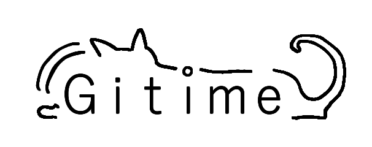

# Gitime

## 프로젝트 소개

- 깃티미(Gitime)는 깃허브와 연동하고, 각 프로젝트에 대해 대시보드를 중심으로 하는 팀 협업 기능을 제공하는 웹 서비스입니다.

## 사용 기술

### Front-end 개발

  

### 버전 관리

  
  

### 개발 환경

  

### 디자인

  

## 화면 구성 및 기능

### 메인 페이지, 로그인, 회원가입

| 메인 페이지                                  | 로그인                                 |
| -------------------------------------------- | -------------------------------------- |
|  |  |

- 메인 페이지에선 각 기능에 대해 간단하게 소개하고 있으며, 사용자는 상단의 헤더로 각 기능에 접근하거나 로그인, 회원가입을 할 수 있습니다.

| 회원가입(이메일 및 비밀번호 입력)            | 회원가입(사용자 정보 입력, 인증)               |
| -------------------------------------------- | ---------------------------------------------- |
|  |  |

| 최초 서비스 이용시 깃허브 연동       | 연동 후 팀 목록                      | 팀 생성                              |
| ------------------------------------ | ------------------------------------ | ------------------------------------ |
|  |  |  |

- 회원가입 후, 사용자는 깃허브 연동을 요청받습니다. Github 계정에 로그인함으로써 연동하면 해당 계정의 레포지토리에 접근이 가능해집니다.
- 팀 목록 페이지에선 팀을 새롭게 생성하거나, 초대 코드 입력을 통해 기존 팀에 참여할 수도 있습니다. 팀 생성은 레포지토리를 기반으로 이루어집니다.

### 대시보드

| 대시보드                                       | 캘린더                                       |
| ---------------------------------------------- | -------------------------------------------- |
|  |  |

- 팀 목록에서 특정 팀을 선택해 대시보드로 이동할 수 있습니다.
- 대시보드에선 프로젝트의 진행 사항, 일정, 투두 리스트, 자료실, 캘린더 정보를 제공합니다.
- 목표 관리하기 버튼을 통해 투두 리스트를 관리하는 모달창을 띄울 수 있습니다.
- 캘린더에선 특정 날짜를 누르면 해당 날짜에 맞는 투두 리스트를 확인할 수 있습니다.

| 목표 관리하기(투두 리스트)           | 자료실                                 | 자료실 글 상세보기                   |
| ------------------------------------ | -------------------------------------- | ------------------------------------ |
|  |  |  |

- 목표 관리하기 모달에선 목표를 새롭게 추가하거나, 체크 표시를 눌러 기존 목표를 '완료' 처리할 수 있습니다.
- 자료실에선 글을 작성해 자료를 업로드할 수 있으며, 글 목록에서 글을 조회할 수 있습니다.

### 팀 관리

| 팀원 초대                                | 팀원 역할 설정                             |
| ---------------------------------------- | ------------------------------------------ |
|  |  |

- 팀 관리 페이지로 이동하면 팀 관리, 팀원 관리를 할 수 있습니다.
- 팀원 관리에선 팀원을 초대하거나 팀원의 역할을 설정할 수 있습니다.

| 개발 분야 관리                             | 공지사항 관리                              |
| ------------------------------------------ | ------------------------------------------ |
|  |  |

- 팀 관리에선 개발 분야, 공지사항, 팀 설정, 깃허브 연동을 관리할 수 있습니다.
